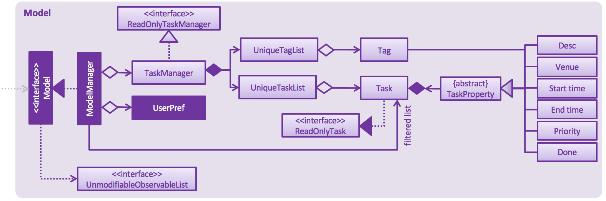

# Developer Guide

* [Setting Up](#setting-up)
* [Design](#design)
* [Implementation](#implementation)
* [Testing](#testing)
* [Dev Ops](#dev-ops)
* [Appendix A: User Stories](#appendix-a--user-stories)
* [Appendix B: Use Cases](#appendix-b--use-cases)
* [Appendix C: Non Functional Requirements](#appendix-c--non-functional-requirements)
* [Appendix D: Glossary](#appendix-d--glossary)
* [Appendix E : Product Survey](#appendix-e--product-survey)

## Setting up

#### Prerequisites

1. **JDK `1.8.0_60`**  or later 

    > Having any Java 8 version is not enough.  
    This app will not work with earlier versions of Java 8.

2. **Eclipse** IDE

3. **e(fx)clipse** plugin for Eclipse (Do the steps 2 onwards given in
   [this page](http://www.eclipse.org/efxclipse/install.html#for-the-ambitious))  

4. **Buildship Gradle Integration** plugin from the Eclipse Marketplace

#### Importing the project into Eclipse

1. Fork this repo, and clone the fork to your computer
2. Open Eclipse (Note: Ensure you have installed the **e(fx)clipse** and **buildship** plugins as given
   in the prerequisites above)
3. Click `File` > `Import`
4. Click `Gradle` > `Gradle Project` > `Next` > `Next`
5. Click `Browse`, then locate the project's directory
6. Click `Finish`

  > * If you are asked whether to 'keep' or 'overwrite' config files, choose to 'keep'.
  > * Depending on your connection speed and server load, it can even take up to 30 minutes for the set up to finish
      (This is because Gradle downloads library files from servers during the project set up process)
  > * If Eclipse auto-changed any settings files during the import process, you can discard those changes.

#### Troubleshooting project setup

**Problem: Eclipse reports compile errors after new commits are pulled from Git**

* Reason: Eclipse fails to recognize new files that appeared due to the Git pull.
* Solution: Refresh the project in Eclipse: 
  Right click on the project (in Eclipse package explorer), choose `Gradle` -> `Refresh Gradle Project`.

**Problem: Eclipse reports some required libraries missing**

* Reason: Required libraries may not have been downloaded during the project import.
* Solution: [Run tests using Gardle](UsingGradle.md) once (to refresh the libraries).

## Design

### Architecture

Fig 1: Architecture Diagram for the App

 
The **_Architecture Diagram_** given above explains the high-level design of the App.
Given below is a quick overview of each component.

`Main` has only one class called [`MainApp`](../src/main/java/seedu/manager/MainApp.java). It is responsible for,
* At app launch: Initializing the components in the correct sequence, and connects them up with each other.
* At shut down: Shutting down the components and invokes cleanup method where necessary.

[**`Commons`**](#common-classes) represents a collection of classes used by multiple other components.
Two of those classes play important roles at the architecture level.
* `EventsCentre` : This class (written using [Google's Event Bus library](https://github.com/google/guava/wiki/EventBusExplained))
  is used by components to communicate with other components using events (i.e. a form of _Event Driven_ design)
* `LogsCenter` : This class is used by various other classes to write log messages to the App's log file.

The rest of the App consists four components.
* [**`UI`**](#ui-component) : The UI of the App.
* [**`Logic`**](#logic-component) : The command executor.
* [**`Model`**](#model-component) : The container for the App's in-memory data.
* [**`Storage`**](#storage-component) : The interface between the App and the hard disk.

Each of the four components
* Defines its _API_ in an `interface` with the same name as the Component.
* Exposes its functionality using a `{Component Name}Manager` class.

For example, the `Logic` component defines it's API in the `Logic.java`
interface and exposes its functionality using the `LogicManager.java` class. 

The _Sequence Diagram_ below shows how the components interact for the scenario where the user issues the
command `delete 3`.
 

Fig 2: Sequence Diagram for Delete Task

>Note how the `Model` simply raises a `TaskManagerChangedEvent` when the Task Manager data are changed,
 instead of asking the `Storage` to save the updates to the hard disk.

The diagram below shows how the `EventsCenter` reacts to that event, which eventually results in the updates
being saved to the hard disk and the status bar of the `UI` being updated to reflect the 'Last Updated' time.  

Fig 3: Sequence Diagram for Event Handling for Delete Task

> Note how the event is propagated through the `EventsCenter` to the `Storage` and `UI` without `Model` having
  to be coupled to either of them. This is an example of how this Event Driven approach helps us reduce direct
  coupling between components.

The sections below give more details of each component.

### `UI` component

Fig 4: Class Diagram for UI component

**API** : [`Ui.java`](../src/main/java/seedu/manager/ui/Ui.java)

The `UI` consists of a `MainWindow` that is made up of parts e.g.`CommandBox`, `ResultDisplay`, `TaskListPanel`,
`StatusBarFooter` etc. All these, including the `MainWindow`, inherit from the abstract `UiPart` class
and they can be loaded using the `UiPartLoader`.

The `UI` component uses JavaFx UI framework. The layout of these `UI` parts are defined in matching `.fxml` files
 that are in the `src/main/resources/view` folder. For example, the layout of the [`MainWindow`](../src/main/java/seedu/manager/ui/MainWindow.java) is specified in
 [`MainWindow.fxml`](../src/main/resources/view/MainWindow.fxml).

The `UI`,
* Executes user commands using the `Logic` component.
* Binds itself to some data in the `Model` so that the `UI` can auto-update when data in the `Model` change.
* Responds to events raised from various parts of the App and updates the `UI` accordingly.

### Logic component

Fig 5: Class Diagram for Logic component

**API** : [`Logic.java`](../src/main/java/seedu/manager/logic/Logic.java)

The `Logic`,
* Uses the `Parser` class to parse the user command. The `Parser` class employs an `ExtensionParser` class to parse extensions into Task Properties.
* Executes the `Command` object returned by the `Parser` class.
* Encapsulates the result of the command execution as a `CommandResult` object and passes it back to the `UI`.

> The command execution can affect the `Model` (e.g. adding a task) and/or raise events.

Given below is the Sequence Diagram for interactions within the `Logic` component for the `execute("delete 1")`
 API call.  
 

Fig 6: Sequence Diagram for Delete command in Logic component

### Model component

Fig 7: Class Diagram for Model component

**API** : [`Model.java`](../src/main/java/seedu/manager/model/Model.java)

The `Model`,
* Stores a `UserPref` object that represents the user's preferences.
* Stores the Task Manager data.
* Exposes a `UnmodifiableObservableList<ReadOnlyTask>` that can be 'observed' e.g. the `UI` can be bound to this list so that the `UI` automatically updates when the data in the list change.
* Does not depend on any of the other three components.

### Storage component

Fig 8: Class Diagram for Storage component

**API** : [`Storage.java`](../src/main/java/seedu/manager/storage/Storage.java)

The `Storage` component,
* Saves `UserPref` objects in json format and reads it back.
* Saves the Task Manager data in xml format and reads it back.

### Common classes

Classes used by multiple components are in the [`seedu.manager.commons`](#../src/main/java/seedu/manager/commons) package.

## Implementation

### Logging

We are using `java.util.logging` package for logging. The `LogsCenter` class is used to manage the logging levels
and logging destinations.

* The logging level can be controlled using the `logLevel` setting in the configuration file
  (See [Configuration](#configuration))
* The `Logger` for a class can be obtained using `LogsCenter.getLogger(Class)` which will log messages according to the specified logging level
* Currently log messages are output through `Console` and to a `.log` file.

**Logging Levels**

* `SEVERE` : Critical problem detected which may possibly cause termination of the application
* `WARNING` : Application can continue, but with caution
* `INFO` : Information showing the noteworthy actions by the App
* `FINE` : Details that are not usually noteworthy but may be useful in debugging
  e.g. print the actual list instead of just its size

### Configuration

Certain properties of the application can be controlled (e.g App name, logging level) through the configuration file (default: `config.json`).

## Testing

Tests can be found in the `./src/test/java` folder.

**In Eclipse**:

* To run all tests, right-click on the `src/test/java` folder and choose
  `Run as` > `JUnit Test`
* To run a subset of tests, you can right-click on a test package, test class, or a test and choose
  to run as a JUnit test.

**Using Gradle**:

* See [UsingGradle.md](UsingGradle.md) for how to run tests using Gradle.

We have two types of tests:

1. **GUI Tests** - These are _System Tests_ that test the entire App by simulating user actions on the GUI.
   These are in the `guitests` package.

2. **Non-GUI Tests** - These are tests not involving the GUI. They include,
   1. _Unit tests_ targeting the lowest level methods/classes.  
      e.g. `seedu.manager.commons.UrlUtilTest`
   2. _Integration tests_ that are checking the integration of multiple code units
     (those code units are assumed to be working). 
      e.g. `seedu.manager.storage.StorageManagerTest`
   3. Hybrids of unit and integration tests. These test are checking multiple code units as well as
      how the are connected together. 
      e.g. `seedu.manager.logic.LogicManagerTest`

**Headless GUI Testing** :

Thanks to the [TestFX](https://github.com/TestFX/TestFX) library we use,
 our GUI tests can be run in the _headless_ mode.
 In the headless mode, GUI tests do not show up on the screen.
 That means the developer can do other things on the Computer while the tests are running. 
 See [UsingGradle.md](UsingGradle.md#running-tests) to learn how to run tests in headless mode.

#### Troubleshooting tests

 **Problem: Tests fail because NullPointException when AssertionError is expected**

 * Reason: Assertions are not enabled for JUnit tests.
   This can happen if you are not using a recent Eclipse version (i.e. _Neon_ or later)
 * Solution: Enable assertions in JUnit tests as described
   [here](http://stackoverflow.com/questions/2522897/eclipse-junit-ea-vm-option).  
   Delete run configurations created when you ran tests earlier.

## Dev Ops

### Build Automation

See [UsingGradle.md](UsingGradle.md) to learn how to use Gradle for build automation.

### Continuous Integration

We use [Travis CI](https://travis-ci.org/) to perform _Continuous Integration_ on our projects.
See [UsingTravis.md](UsingTravis.md) for more details.

### Making a Release

Here are the steps to create a new release.

 1. Generate a JAR file [using Gradle](UsingGradle.md#creating-the-jar-file).
 2. Tag the repo with the version number. e.g. `v0.1`
 3. [Create a new release using GitHub](https://help.github.com/articles/creating-releases/)
    and upload the JAR file your created.

### Managing Dependencies

A project often depends on third-party libraries. For example, Task Ninja depends on the
[Jackson library](http://wiki.fasterxml.com/JacksonHome) for XML parsing. Managing these _dependencies_
can be automated using Gradle. For example, Gradle can download the dependencies automatically, which
is better than these alternatives. 
a. Include those libraries in the repo (this bloats the repo size) 
b. Require developers to download those libraries manually (this creates extra work for developers) 

## Appendix A : User Stories

Likeliness: Likely - `L`, Unlikely - `U`

Likeliness | As a... | I want to... | So that I can...
-------- | :-------- | :--------- | :-----------
`L` | All Users | Interact with the manager using a CLI and keys | Get rid of the need for a mouse
`L` | All Users | Use a keyboard shortcut to activate the manager | Speed up my workflow
`L` | New User | View info about a command | Learn how to use these commands
`L` | User | Add tasks with a description and a specific deadline | Set deadlines for tasks
`L` | User | Add tasks with description, start time and end time | Create events in the calendar
`L` | User | Add tasks with only a description | Set tasks that need to be completed at some point of time
`L` | User | Modify a task | Update deadlines and descriptions
`L` | User | Delete a task | Reflect my not having to do a task anymore in my to do list
`L` | User | Tick off a task | Record that this task is complete
`L` | User | Search for (a) task(s) | Find (a) task(s) and maybe edit it
`L` | User | See upcoming tasks | Decide what to do next
`L` | User | Assign priority to tasks | Gauge which task should be done next
`L` | User | See tasks in a specific period of time | See what has been scheduled for a certain period
`L` | User | See upcoming tasks up until a specified time | See less / more upcoming tasks according to the time frame I want
`L` | User | Declare tasks that have to be done after a certain time | Record these tasks somewhere and not be bothered by them until a certain time
`L` | User | Undo operation(s) | Remove a mistake
`L` | Advanced User | Edit the storage file | Make changes without having to go through the manager
`L` | Advanced User | Declare my own names for commands | Personalise the experience and make it faster
`U` | New User | View the procedure of creating a task | Learn how to create a task first
`U` | User | Redo operation(s) | Redo a change that had been undone
`U` | User | Declare recurring tasks | Remove the need to enter these tasks multiple times
`U` | User | Search for empty slots (within a given time frame) | Decide when to schedule a task
`U` | User | Integrate with third-party applications like GCalendar | Access my tasks on another platform too
`U` | User | List [floating tasks](#floating-task) | See whether I want to complete a floating task next
`U` | User | Sort upcoming tasks by priority | Make the decision of which task to complete next faster
`U` | User | Block multiple slots for a task | Choose later which slot I want to assign this task to and keep the selected slots free for that task
`U` | User | Decide slot for an item blocking multiple slots | Free up the other slots for other tasks
`U` | User | Receive emails/notifications about pressing deadlines | Be reminded to complete these tasks

## Appendix B : Use Cases

(For all use cases below, the **System** is the `TaskManager` and the **Actor** is the `User`, unless specified otherwise)

#### Use case: Add a task

**MSS**

1. Users supplies Task Manager with information for a new task
2. Task Manager adds new task to its data  
Use case ends.

**Extensions**

2a. The given information is invalid

> 2a1. User is shown correct format for data  
Use case resumes at step 1

2b. Given information is identical to an already existing task

> 2b1. User is notified that task already exists  
Use case resumes at step 1

#### Use case: List specific tasks

**MSS**

1. User supplies Task Manager with information about descriptions of tasks to be listed
2. Task Manager shows the list of tasks  
Use case ends.

**Extensions**

2a. The list is empty

> Use case ends

2b. The given information is invalid

> 2a1. User is shown correct format for data  
Use case resumes at step 1

#### Use case: Delete task

**MSS**

1. User requests to list tasks
2. Task Manager shows a list of tasks
3. User requests to delete a specific task in the list
4. Task Manager deletes the task  
Use case ends.

**Extensions**

2a. The list is empty

> Use case ends

4a. The given index is invalid

> 4a1. User is notified that index is invalid  
Use case resumes at step 3

#### Use case: Edit task

**MSS**

1. User requests to list tasks
2. Task Manager shows a list of tasks
3. Users supplies Task Manager with new information for a specific task
4. Task Manager modifies the corresponding task

**Extensions**

2a. The list is empty

> Use case ends

4a. The given index is invalid

> 4a1. User is notified that index is invalid  
Use case resumes at step 3

4b. The given information is invalid

> 4b1. User is shown correct format for data  
Use case resumes at step 3

## Appendix C : Non Functional Requirements

1. Should work on any [mainstream OS](#mainstream-os) as long as it has Java `1.8.0_60` or higher installed.
2. Should be able to hold up to 1000 tasks.
3. Should come with automated unit tests and open source code.
4. Should open within 1 second.
5. Should complete all operations within 0.5 seconds.
6. Should not require an internet connection to work.
7. Should not require installation to work.

## Appendix D : Glossary

##### Mainstream OS

> Windows, Linux, Unix, OS-X

##### Floating Task

> A task which has no specified date or time

## Appendix E : Product Survey

We researched other task managers' special features to better understand the products available and thus enhance design of our own product. Here are the special features we found in four other products:

##### Todo.txt
1. Uses command lines to input task
2. Shows a piece of message of the index of task added
3. Uses plain text as the normal text
4. Sorts the task by priority
5. Allows user to enter multiple tasks in a single input box

##### Google Calendar
1. Very detailed, but have to click many times to add a task
2. User can change visibility between public and private
3. User can make video calls and change the time zone
4. User can also add attachments and locations
5. Also has a command line mode

##### Wunderlist
1. Amazing GUI
2. User can set reminders, additionally the "Do not disturb" button can be used to turn off reminders
3. Mainly uses a list to represent all the tasks rather than a calendar

###### Wunderline
1. The command line mode of Wunderlist
2. Uses natural words as commands, content is put inside single quotes
3. Data can be exported as a JSON file
4. Allows searching by keywords (doesn't need single quotes)

##### Calendar Vim
1. A calendar application for Vim
2. View events on Google Calendar
3. Has different view modes, like Year view, Month view, Week view and Day view
